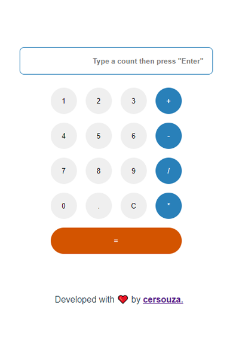

# Vue Calculator App



***

## 1. About 📙
**🌐 Link: https://vue-calculator-app.vercel.app**

This is a simple Calculator made as personal boilerplate of project with technologies:
- Vue.js;
- Vuex;
- Testing Library;

## 2. Setup 💻

```bash
npm i
```

## 3. Run in development mode ▶️

```bash
npm run serve

```

## 4. Run UI tests 🧪

```bash
npm run test

```

## Utils
- **Colors pallete:** https://flatuicolors.com/palette/defo;
- **Icons:** made by [Pixel perfect](https://www.flaticon.com/authors/pixel-perfect) from [www.flaticon.com](https://www.flaticon.com/)
